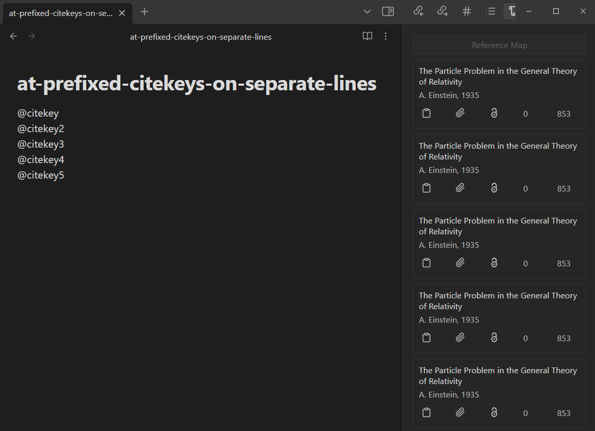

# Obsidian Reference Map Test

Test repository for the [Obsidian Reference Map](https://github.com/anoopkcn/obsidian-reference-map) plugin. Clone this repo

```Shell
git clone https://github.com/blakeNaccarato/obsidian-reference-map-test.git ~/reference-map-test
```

Then switch to this branch

```Shell
cd ~/reference-map-test
git checkout fix-md-link-regex
```

Then clone my fork of the plugin into the plugins directory

```Shell
git clone https://github.com/blakeNaccarato/obsidian-reference-map.git .obsidian/plugins/obsidian-reference-map
```

Then switch that repo to the bugfix branch and run the dev build task

```Shell
cd ~/reference-map-test/.obsidian/plugins/obsidian-reference-map
git checkout fix-md-link-regex
npm run dev
```

Now open the vault at `~/obsidian-reference-map-test` in Obsidian.

## Passing tests

Here are some notable passing tests:

- wikilink: A trivial Markdown note with a single citekey in a WikiLink
- wikilink-alt-text: A trivial markdown note with a single citekey in a WikiLink with alt text

### Citekeys with `@` on separate lines



## Failing tests

Here are some notable failing tests:

- markdown-link
- markdown-link-alt-text
- mixed-citekey-tests

### Citekeys with `@` on the same line

We should see five references in the sidebar, but we only see one.

